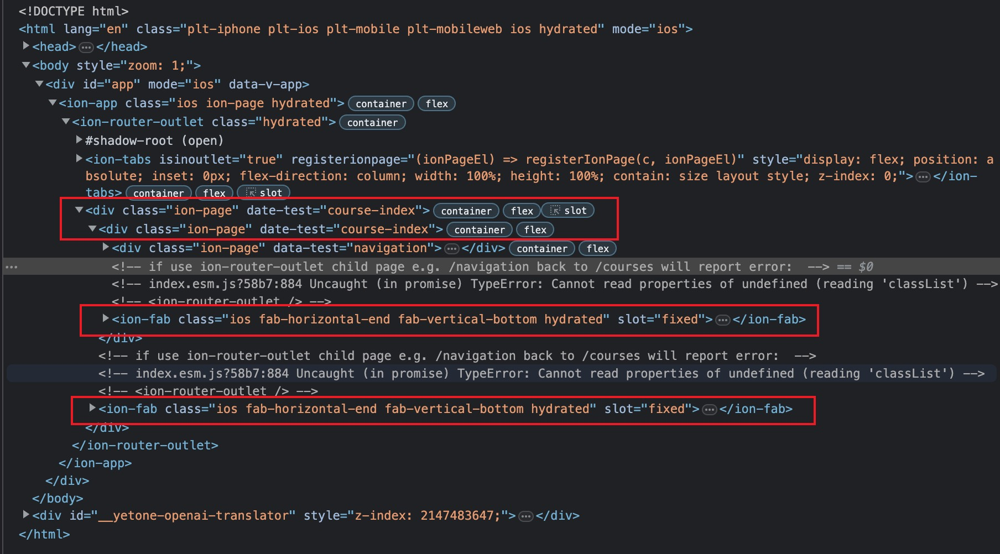
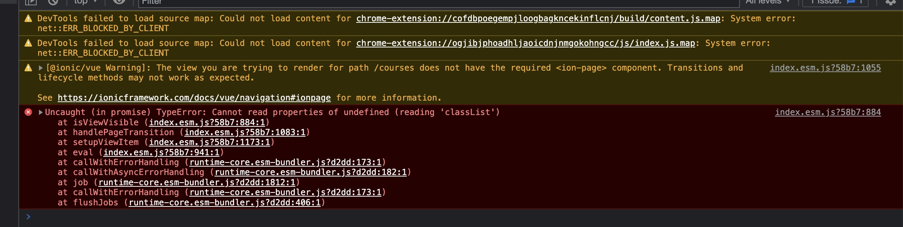

This Project is an minimal reproduction for some [Ionic Framework](https://ionicframework.com/) error

Ionic Vue 5 + Vue3 + Typescript Tabs Project


**minimal reproduction: [https://github.com/peixin/ionic5-vue3-ts-example](https://github.com/peixin/ionic5-vue3-ts-example)**

**preview: [https://ionic5-vue3-ts-example.vercel.app](https://ionic5-vue3-ts-example.vercel.app)**


### Error 1:

ion-page render multiple times, and it cause some common component in router page which shared for all child router render multiple times



### Error 2:

sub-router back to parent tab router report error:

```
Uncaught (in promise) TypeError: Cannot read properties of undefined (reading 'classList')

at isViewVisible (index.esm.js?58b7:884:1)
at handlePageTransition (index.esm.js?58b7:1083:1)
at setupViewItem (index.esm.js?58b7:1173:1)
at eval (index.esm.js?58b7:941:1)
at callWithErrorHandling (runtime-core.esm-bundler.js?d2dd:173:1)
at callWithAsyncErrorHandling (runtime-core.esm-bundler.js?d2dd:182:1)
at job (runtime-core.esm-bundler.js?d2dd:1812:1)
at callWithErrorHandling (runtime-core.esm-bundler.js?d2dd:173:1)
at flushJobs (runtime-core.esm-bundler.js?d2dd:406:1)
```




### Links

[Github Issue](https://github.com/ionic-team/ionic-framework/issues/26987)

[Ionic Forum](https://forum.ionicframework.com/t/ionic-vue-render-nested-ion-page-tag/231909)


